## Name: QuizBowl

### Link: [https://quizbowl-opal.vercel.app/](https://quizbowl-opal.vercel.app/)

### Api:
- my api has 2 endpoints that the user interacts with directly: quiz and questions
- quiz: GET-loads the basic quiz info such as the title, description, genre, and id
POST- inserts this info into the database when creating a new quiz
- questions: GET - loads an array of questions and their correct answer with their question id
POST - inserts the questions into the database

### Summary :
This app allows users to create quizzes up to 20 questions and post them either publicly in which case they are accessible by everyone via the webapp or they can be made private in which case they are only accessible via the link provided to the user upon creation.

### Screenshots:
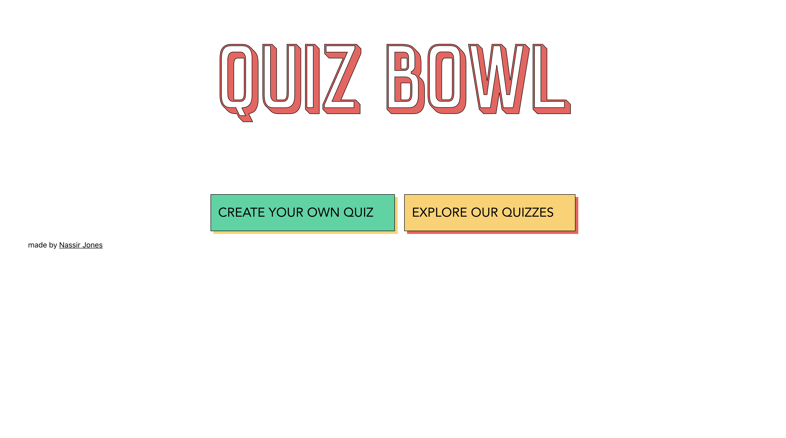

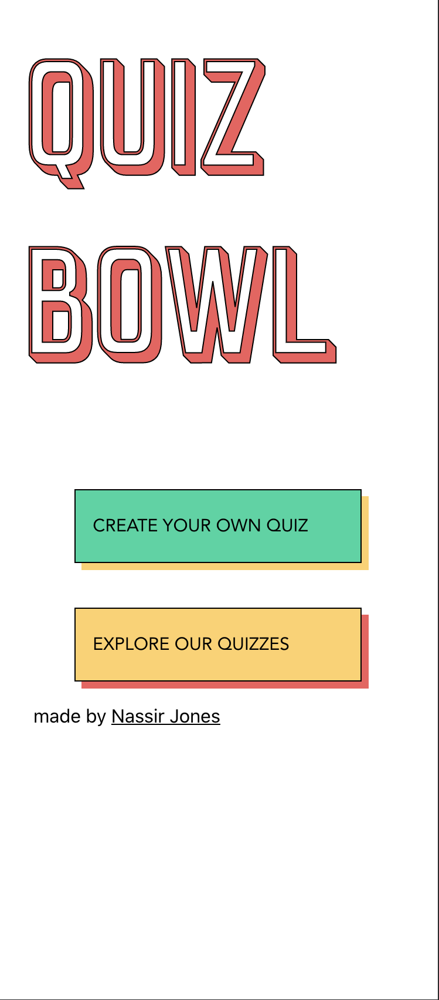

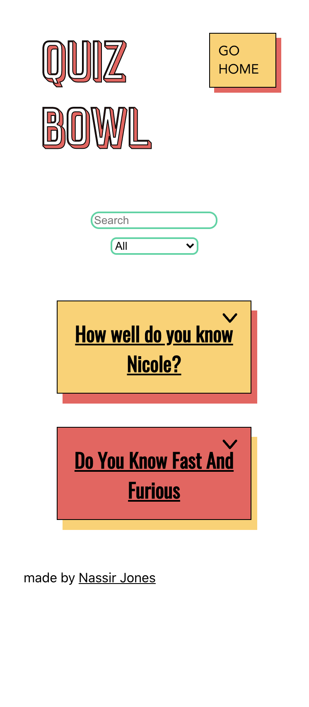

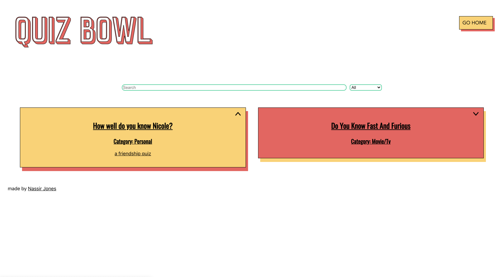

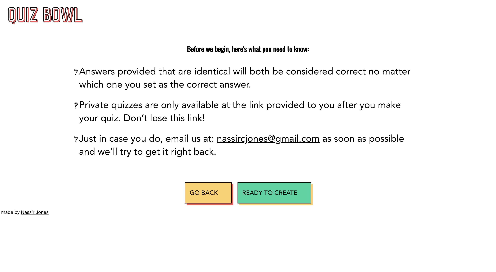

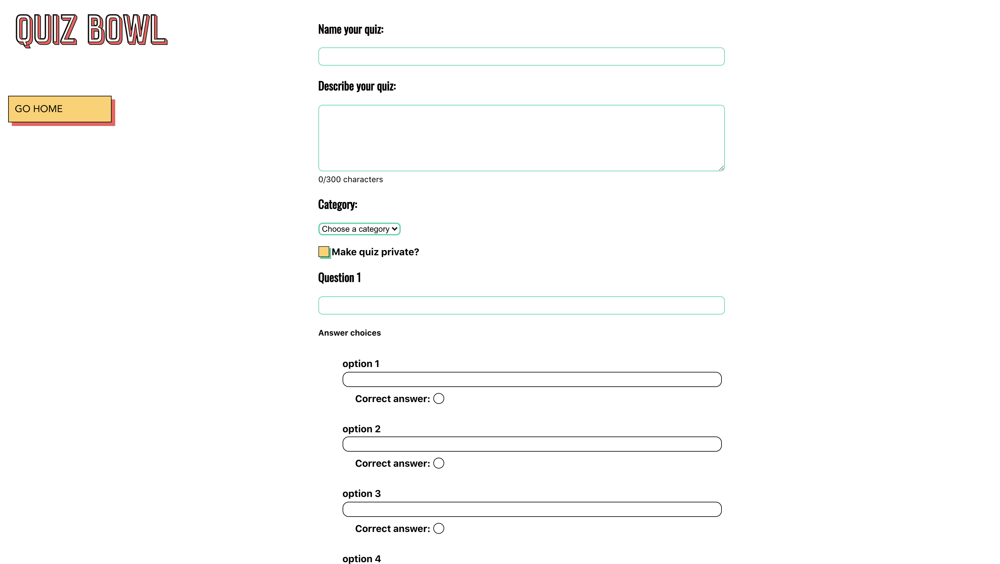

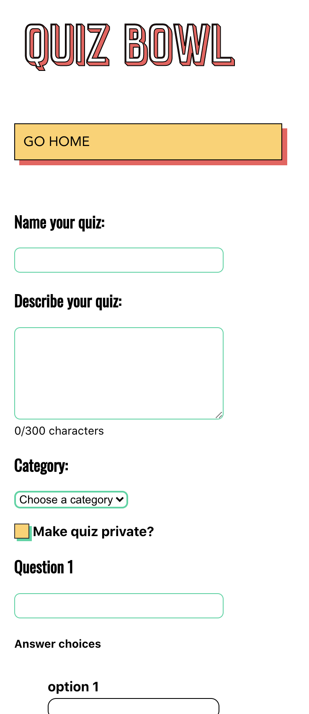

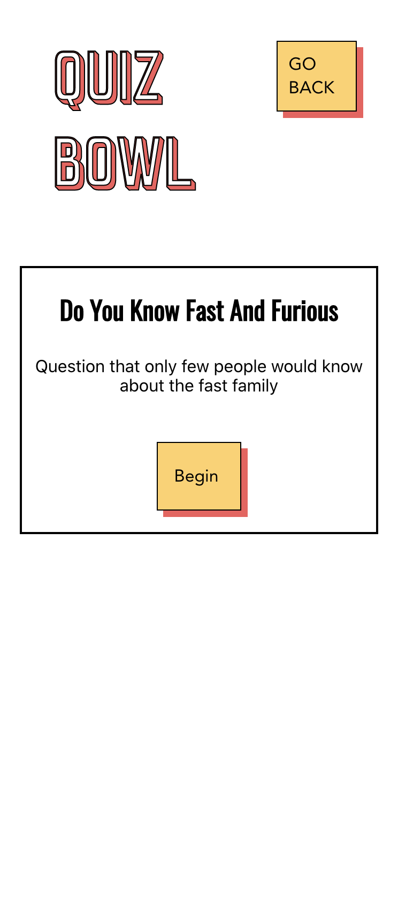

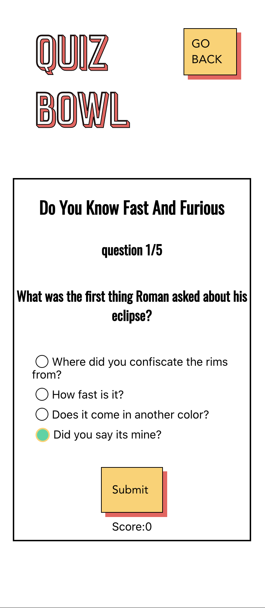

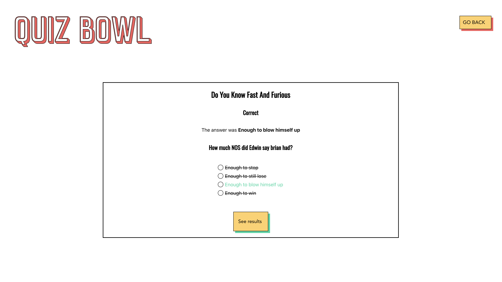

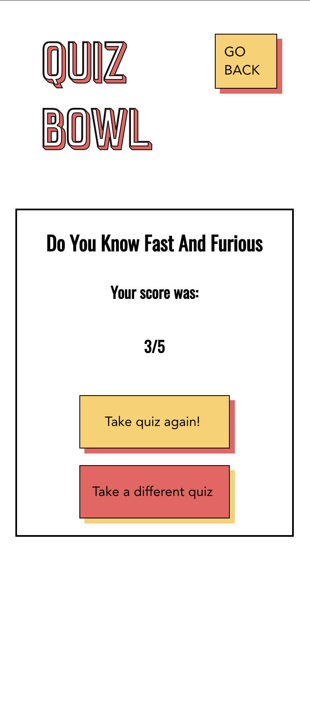

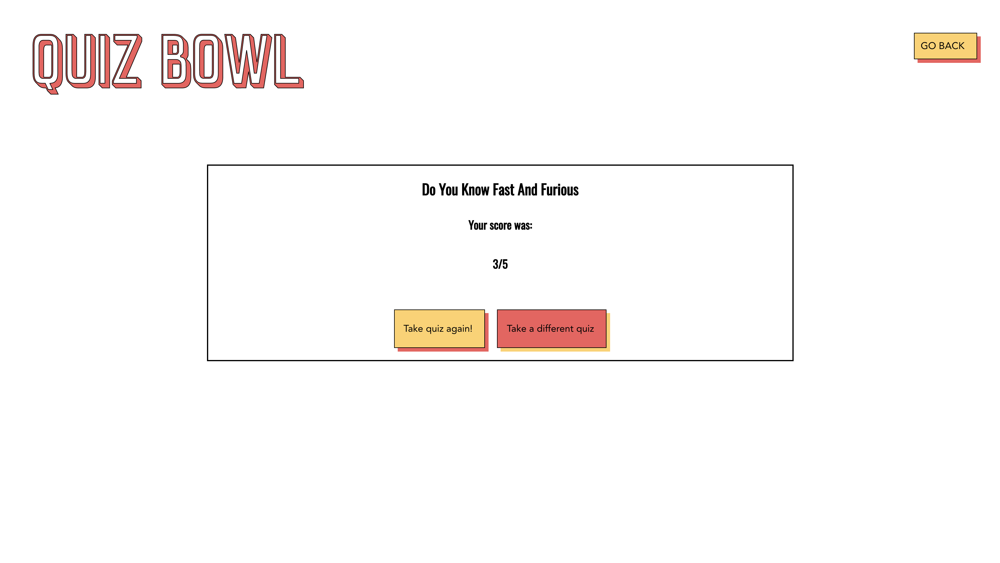

### technology used:
- React, CSS, Node, Express, and PostgreSQL